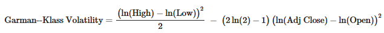
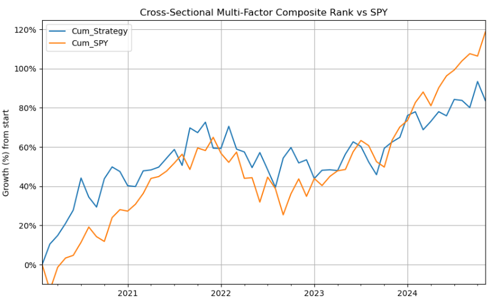
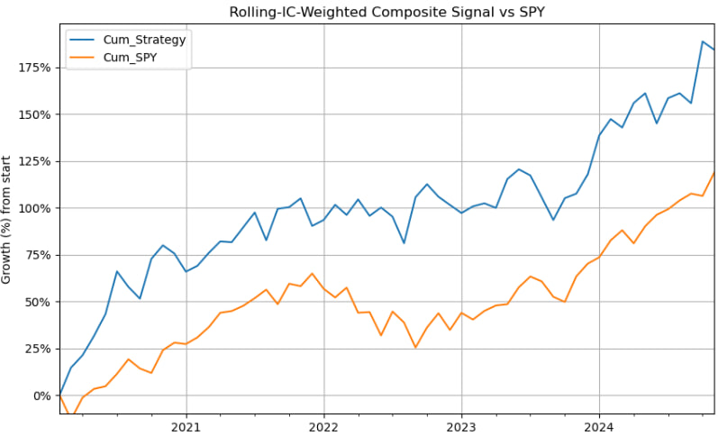

# Quantitative Portfolio Construction using Backtested Trading Signals

## 1. Purpose of Project

This project seeks to construct portfolios using quantitative analysis/modelling techniques of technical indicators as features, rebalancing the portfolio of stocks every month.

The technical indicators curated as features for quantitative analysis are as follows:
- Garman-Klass Volatility
- RSI
- Bollinger Bands
- ATR
- MACD
- Fama-French 5 Factors
  - Mkt-RF: Market excess return
  - SMB (Small Minus Big): Size premium (small vs large caps)
  - HML (High Minus Low): Value premium (high vs low book-to-market)
  - RMW (Robust Minus Weak): Profitability premium (profitable vs unprofitable firms)
  - CMA (Conservative Minus Aggressive): Investment premium (low vs high asset growth)

I then used these features to backtest trading signals including but not limited to:
1. Long-only RSI-Momentum Trading Signal
2. Cross-Sectional Multi-Factor Composite Rank
3. Rolling-IC-Weighted Composite Signal

Further Improvements & Additional Explorations:
- Building a LSTM ML Model for Stock Price Prediction

## 2. Methodology

### 2.1. Data Extraction
I first performed data extraction of the S&P500 stocks from Wikipedia today, as stocks that will form my dataset for my exploration. This list of S&P500 stocks has survivorship bias; it only looks at the current S&P500 stocks today and does not include stocks that used to be in the S&P500 during my analysis period but are no longer there.

From there, I used the yfinance package to extract the stock price data for these stocks at the end of each day, with data including: Adj Close, Close, High, Low, Open, Volume.

### 2.2. Exploration of Technical Indicators & Features of Stocks
I curated the following technical indicators for each stock as below, explaining their significance:

**Garman-Klass Volatility**
- Garman-Klass volatility uses **open, high, low, and closing prices** to provide a more accurate estimate of a stock's volatility than typical methods that only consider closing prices. It captures **intraday price movements** and is often used to **assess the risk associated with a stock**, especially in relation to its potential for rapid price changes.

It is calculated as follows:

**RSI**
- The Relative Strength Index (RSI) is a technical indicator that measures the **speed and magnitude of price changes on a stock**, providing insights into its momentum. It's often used to identify **potential overbought or oversold conditions**.

**Bollinger Bands**
- Bollinger Bands are a technical analysis tool that helps traders assess a stock's price **volatility** and identify potential trading opportunities. They consist of a **middle band (a moving average) and two outer bands (standard deviations away from the moving average)**. By observing how the price moves in relation to these bands, traders can gauge whether a stock is **overbought, oversold, or experiencing a potential trend change**.

**ATR**
- The Average True Range (ATR) is a technical analysis indicator that measures **price volatility over a specific period, typically 14 days**. It helps traders understand how much a stock's price fluctuates and can be used to **set stop-loss levels and manage risk**. 

**MACD**
- The MACD (Moving Average Convergence Divergence) is a technical indicator that helps investors **identify trends, momentum, and potential entry and exit points** for trades in a stock. It does this by **showing the relationship between two exponential moving averages (EMAs) of a stock's price**. 

## 2.3. Aggregate to Monthly Level and Filter for Top 100 Most Liquid Stocks For Each Month
I extracted the **top 100 most liquid companies by 5y rolling average dollar_volume**, to narrow my search and aggregate the features to **monthly level** for just the technical indicators (not open/close/high/low type of stats).

## 2.4. Calculation of Monthly Returns for Different Time Horizons
To capture time series dynamics that reflect, for example, momentum patterns, I compute historical returns using the method .pct_change(lag), that is, returns over monthly periods as identified by lags (num of periods/months back). I computed monthly returns for 1, 2, 3, 6, 9, 12 month periods.

## 2.5. Exploration of additional features (Fama-French Indicators) and Calculation of Rolling Factor Betas
I introduced Fama-French data to estimate the exposure of assets to common risk factors using linear regression. The 5 Fama-French factors (market risk, size, value, operating profitability, and investment) have been shown empirically to explain asset returns and are **commonly used to assess the risk/return profile of portfolios**. 
By regressing my portfolio returns on these five-factor returns, I can see how much of our risk/returns come from i.e. 'tilted small-cap' or 'high-profitability' exposures as compared to true alpha (unexplained residual).

Hence, I included these past factor exposures as financial features in models.

Furthermore, I accessed the historical factor returns using the pandas-datareader and estimate historical exposures using the RollingOLS rolling linear regression.

## 2.6. Backtesting algorithmic trading strategies

#### 2.6.1. Long-only RSI-Momentum Trading Signal
I first explored a simple backtest of RSI on *fwd1m* returns, by taking the top 20% of stocks with highest RSI each month to construct my portfolio, simulating the returns for the next month using *fwd1m* returns, rebalancing the portfolio each time.

With this strategy, I was able to achieve in the 5-year period:
- Cumulative returns of **184%** vs 119% for holding SPY throughout
- CAGR of **24.6%** vs  17.9% for holding SPY throughout
- Sharpe Ratio of **1.21** vs 1.00 for holding SPY throughout
- Max Drawdown of **-0.12** vs -0.24 for holding SPY throughout

Here is the comparative returns of backtesting this strategy against holding SPY throughout:

#### 2.6.2. Cross-Sectional Multi-Factor Composite Rank
Next, I explored another trading signal which incorporated all of the features available, by z-scoring each indicator for each stock for each date, and summing them up to create a composite indicator of the z-scores. I then rebalanced the portfolio each month with the top 20% of this ranked composite signal.

With this strategy, I was able to achieve in the 5-year period:
- Cumulative returns of **84%** vs 119% for holding SPY throughout
- CAGR of **13.7%** vs  17.9% for holding SPY throughout
- Sharpe Ratio of **0.79** vs 1.00 for holding SPY throughout
- Max Drawdown of **-0.19** vs -0.24 for holding SPY throughout

Here is the comparative returns of backtesting this strategy against holding SPY throughout:

#### 2.6.3. Rolling-IC-Weighted Composite Signal
Lastly, I tested a signal that computes every technical/fundamental factor's **24-month information coefficient (IC) with next-month returns**, scaling today's cross-sectional z-scores by those ICs, summing the results into an adaptive composite score, and trading the stocks with the top 20% of scores.

To break it down, here's what I did:
- For each date, for every technical indicator I have (RSI, MACD,..., Mkt-RF, CMA, RMW), I compute the Information Coefficient (IC) of each stock, which is the Pearson correlation of today’s factor values with next month’s returns
- I then calculate the rolling 24-month average IC for each stock at each period for a more robust indicator (rather than simply one-off monthly IC which can be noisy)
- Just like the previous signal, I calculate the cross-sectional z-scores for each factor (normalizing them), based on their cross-sectional mean and SD for the month
- Instead of summing the 24-month-ICs or the factor z-scores, I multiply them together for each period, to get a single composite score for each stock for every period.
- I thus rank all stocks by this composite and select the top 20% to form our portfolio

With this strategy, I obtained the same exact portfolios constructed by the LO-RSI-Momentum strategy above, **achieving the exact same cumulative returns, CAGR, and Sharpe over the 5-year period**.

Here is the comparative returns of backtesting this strategy against holding SPY throughout:

## 3. Conclusion
A simple LO-RSI-Momentum performed the best among my 3 strategy backtests, with the Rolling-IC-Weighted Composite Signal producing the same exact portfolios as the RSI strategy. This was because RSI's 24-month IC with next month returns dwarfed the other factors' ICs, and hence the composite resulted in ~100% RSI, just like the former strategy. To fix this, I would need to further floor or cap weights or use equal weights with rank-sum like we had done, in order to diversify.

Overall, I believe that some further improvements that can be made are:
1. Refining a LO strategy into a L/S, by longing the top 20% and shorting the bottom 20%, which will likely boost Sharpe and result in lower drawdown, albeit at the cost of higher turnover.
2. Adding sector-neutral constraints to prevent unintended sector bets
3. Account for trading costs (commissions, slippage)

## 4. Next steps and further learning projects: 
1. Machine-Learning Model to predict sign/magnitude of *fwd1m* return
2. Filtering signals on market regimes (e.g. only trade when VIX < 20, or SPY > 200d MA, etc.)
3. Volatility Targeting with GARCH
4. Data wrangling across different data channels beyond just yfinance (Bloomberg, Polygon, Crypto APIs)
5. Risk Management & Value-at-Risk (quantifying of tail risks - VaR, CVaR, stress scenarios and backtesting VaR model) 
6. Time-Series Models to improve volatility inputs/returns forecasts with ARIMA/GARCH

I would greatly appreciate any feedback and advice on this project and beyond and any ways I could improve it!

